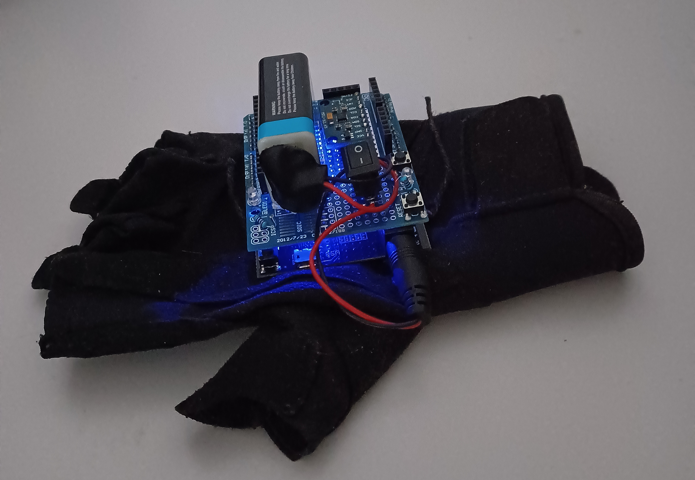
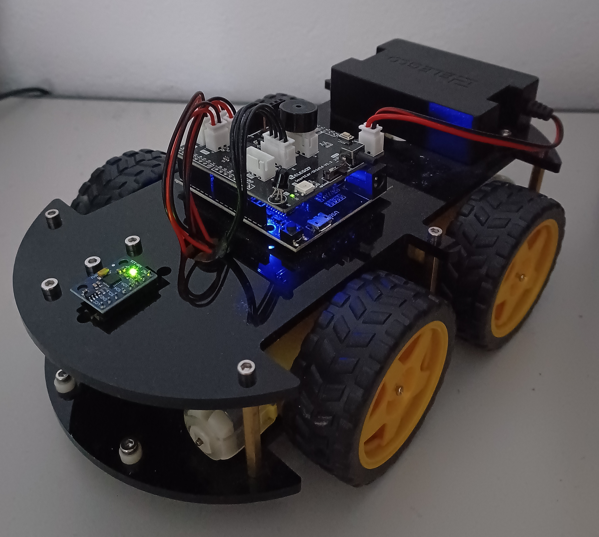

# Remote Control of a Car with Hand Gesture Recognition
Projekt je del diplomske naloge, ki implementira sistem za upravljanje avta z gibi roke. Projekt združuje področja vgrajenih sistemov, brezžične komunikacije ter strojnega učenja. The system consists of:
- A glove with an MPU6500 sensor and an ESP32 microcontroller
- A modified ELEGOO Smart Robot Car V4.0 with an ESP32 microcontroller

The system operates in two modes:
- In normal mode the car moves according to the pitch and roll values.
- In advanced mode the car uses a machine learning model to classify different gestures (circle left/right, zig-zag left/right, spin left/right) and exectures a movement based on the classified gesture.

# Daljinsko upravljanje avtomobila s prepoznavanjem gibov roke

Projekt je del diplomske naloge, ki implementira sistem za upravljanje avta z gibi roke. Projekt združuje področja vgrajenih sistemov, brezžične komunikacije ter strojnega učenja. Sistem sestavljata:
- Rokavica z senzorjem MPU6500 in mikrokrmilnikom ESP32
- Predelan ELEGOO Smart Robot Car V4.0 z mikrokrmilnik ESP32

Sistem deluje v dveh načinih
- V normalnem načinu se avto premika glede na vrednosti pitch in roll.
- V naprednejšem načinu avto s pomočjo modela strojnega učenja klasificira različne gibe (krog v levo/desno, cikcak levo/desno, vrtenje levo/desno) in na podlagi klasificiranega giba izvede premik.

  
  

